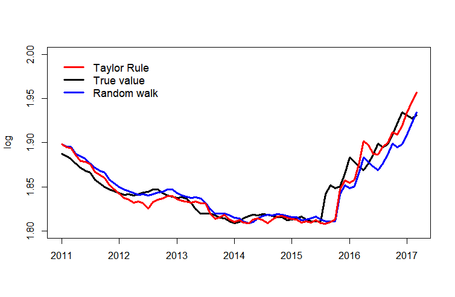

[](http://quantlet.de/)

## [](http://quantlet.de/) **UYCTReur** [](http://quantlet.de/)

```yaml

Name of Quantlet: UYCTReur

Published in: submitted to N/A 

Description: ‘Performs the Unified yield curve Taylor rule in forecasting thed exchange rates, a combination of yield factors are 
tested to have the forecasting ability in forecasting the exchange rates. To fit a model with possible structural changes, we set 
several switching structures on a given dataset. The model is then used for forecasting over 3-12 monthos horizons. The input data 
are monthly observations of exchange rates and the pre-defined yield factors. Computes MAE for the forecasted values. Plots the time 
series ofthe predicted vs. observed values of exchange rates over the prediction interval.’

Keywords: ‘linear model, regression, state-space model, time varying, Markov Switching, exchange rates, prediction.’

Author: Xinjue Li

Submitted:  28 March 2019 by Xinjue Li

Datafile:  FPMMEuroChinaFree.xlsx, PPIEuroChina.xlsx, TRDEuroChina.xlsx, TREuroChina.xlsx, TBR.xlsx

Input: 
- bo                : Starting point of observations 
- b1                : Ending point of observations 
- sigma.s           : Estimation variance
- pred.i(i=1,2,3,4) : Prediction results corresponding to the models
- sl                : Window lengths
- ai                : Forecasting error in MAE 


```




### R Code
```r


