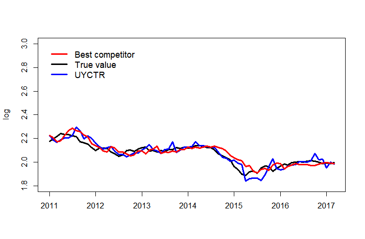
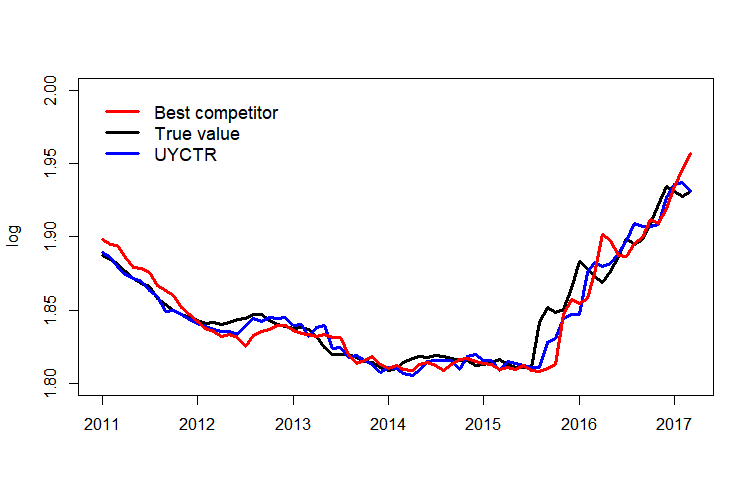

[](http://quantlet.de/)

## [](http://quantlet.de/) **UYCTReur** [](http://quantlet.de/)

```yaml

Name of Quantlet: UYCTReur

Published in: submitted to N/A 

Description: ‘Performs the Unified yield curve Taylor rule in forecasting thed exchange rates, a combination of yield factors are 
tested to have the forecasting ability in forecasting the exchange rates. To fit a model with possible structural changes, we set 
several switching structures on a given dataset. The model is then used for forecasting over 3-12 monthos horizons. The input data 
are monthly observations of exchange rates and the pre-defined yield factors. Computes MAE for the forecasted values. Plots the time 
series ofthe predicted vs. observed values of exchange rates over the prediction interval.’

Keywords: ‘linear model, regression, state-space model, time varying, Markov Switching, exchange rates, prediction.’

Author: Xinjue Li

Submitted:  28 March 2019 by Xinjue Li

Datafile:  FPMMEuroChinaFree.xlsx, PPIEuroChina.xlsx, TRDEuroChina.xlsx, TREuroChina.xlsx, TBR.xlsx

Input: 
- bo                : Starting point of observations 
- b1                : Ending point of observations 
- sigma.s           : Estimation variance
- pred.i(i=1,2,3,4) : Prediction results corresponding to the models
- sl                : Window lengths
- ai                : Forecasting error in MAE 


```






### R Code
```r

rm(list = ls(all = TRUE))
graphics.off()
setwd("")

libraries = c("Hmisc", "readxl", "glmnet", "forecast", "fUnitRoots", "optimx")
lapply(libraries, function(x) if (!(x %in% installed.packages())) {
  install.packages(x)} )
lapply(libraries, library, quietly = TRUE, character.only = TRUE)

# load calculation function
source("UYCTR.r")
e     = read_excel("FPMMEuroChinaFree.xlsx")
e.1   = as.matrix(e[1:dim(e)[1],  2:dim(e)[2]])
ee    = apply(e.1, c(1,2), as.numeric)

# forecasting horizon
h     = 3

# forecasting 
if(h==1){set.seed(30300)} else if(h==3){set.seed(30000)} else{set.seed(30300)}
   
ee.y  = ee[(h+1)  :(length(ee[ ,1])), ]
ee.x  = cbind(ee[1:(length(ee[ ,1])-h),  c(1:8)]) 

X0    =  ee[1:(length(ee[ ,1])-h),  c(1:8)]
Y0    =  ee[(h+1)  :  (length(ee[ ,1])), 1]
       
# number of states
L     =   c(12, 18, seq(24,102,6))
b0    =   121
b1    =   length(ee[, 1])-(h+1)
dlmle     = matrix(0, nrow=300, ncol=length(L))
sigma.s   = rep(0,length(L))
pred      = rep(0, b1)
pred.1    = rep(0, b1)
pred.2    = rep(0, b1)
pred.3    = rep(0, b1)
sl        = rep(0, 300)
beta.fi   = matrix(0, nrow=b1, nco=9)
i.0       = rep(0, length(L))
Lam.pe    = rep(0, length(L))
Lambda    = rep(0, b1-b0+1)
C         = rep(0, length(L))

for(i in c(1:length(L))){
  C[i]    = (L[length(L)]/L[i])^{0.5}
}
cri       = rep(sqrt(8),16)*C
       
# begin forecasting
for(t in b0:b1){
  
  c.1     = matrix(0, nrow =length(L), ncol = 9)
  beta    = matrix(0, nrow =length(L), ncol = 9)
  
  j = 1
  i.0[j]  = t-L[1]
  
  XP      =  X0[i.0[j]:t, ]
  YP      =  Y0[i.0[j]:t]

  # Select the best fitting of A^{*} at the initial step
  cf      = cv.glmnet(x=XP, y=YP, family="gaussian", nlambda=200, alpha=1, nfolds=3, intercept=T)
  Lam.pe[1] = cf$lambda.min
  cef1    = coef(cf, s=c(Lam.pe[1]))  
  x       = XP
  y       = YP
  beta1   = as.vector(cef1)
  beta[j,]= beta1
  x.1     = cbind(1,x)
  sigma.s[1] = sqrt(var(y- x.1%*%beta[j, ]))
 
  for (I in L[2:length(L)]){
    
    j      =  j+1
    i.0[j] = t-I    
    XP     =  X0[i.0[j]:t, ]
    YP     =  Y0[i.0[j]:t]
    
    # Select the best fitting of A^{*} at time point 
    cf          = cv.glmnet(x=XP, y=YP, family="gaussian", nlambda=200, alpha=1, nfolds=5, intercept=T)
    Lam.pe[j]   = cf$lambda.min
    cef1        = coef(cf, s=c(Lam.pe[j]))
    x           = XP
    y           = YP
    beta1       = as.vector(cef1)
    beta[j,]= beta1
    x.1         = cbind(1,x)
    sigma.s[j]  = sqrt(var(y- x.1%*%beta[j, ])) 
    dlmle[t, j] = abs(L.mle(beta[j-1, ], sigma.s[j-1], ee.y[i.0[j]:t, 1], ee.x[i.0[j]:t,  ])-L.mle(beta[j, ], sigma.s[j], ee.y[i.0[j]:t, 1], ee.x[i.0[j]:t,  ]))^(0.5) 
    if (dlmle[t, j]>cri[j]){
    beta.1      = beta[j-1, ]
    pre = as.numeric (beta.1%*% c(1, ee.x[(t+1), ]))
    pred[t+h] = pre
    sl[t] = L[j-1]
    Lambda[t] = Lam.pe[j-1]
    break
    } else{
    beta.1 = beta[j, ]
    pre  = as.numeric (beta.1%*% c(1,ee.x[(t+1), ]))
    pred[t+h] = pre
    sl[t] = L[j]
    Lambda[t] = Lam.pe[j]
    }    
  }  
}
a1 = sum(abs(pred[(b0+h):(b1+h)]-ee.y[(b0+1):(b1+1), 1])/length(pred[(b0+h):(b1+h)]-ee[(b0+h):(b1+h), 3]))
# Random work
a3 = sum(abs(ee[(b0+1):(b1+1), 1]-ee[(b0+h+1):(b1+h+1), 1])/length(ee[(b0+h):(b1+h), 2]-ee[(b0+h):(b1+h), 2]))

# Taylor rule       
E      = read_excel("TREuroChina.xlsx")
E.1    = as.matrix(E[3:dim(E)[1], 2:dim(E)[2]])
Ee     = apply(E.1, c(1,2), as.numeric)
Ee.y   = Ee[(h+1):dim(Ee)[1], ]-Ee[1:(dim(Ee)[1]-h), ]
Ee.x   = Ee[1:(dim(Ee)[1]-h), ]
pred.3 = rep(0, dim(Ee)[1])
l      = 24
B0     = 115
B1     = dim(Ee)[1]- (h+1) 
       
# Taylor rule forecasting
for(j in (B0):(B1)){  
  fit.1       = lm(Ee.y[(j-l):(j), 1]~ 0+ Ee.x[(j-(l)):(j), c(2:4)])  
  beta.2      = fit.1$coefficients
  pred.3[j+h] = as.numeric (t(beta.2[1:length(beta.2)]) %*% Ee.x[j+1, c(2:4)])+Ee.x[j+1, 1]   
}
# forecating error (MAE)
a6 = sum(abs(pred.3[(B0+h):(B1+h)]-Ee[(B0+1+h):(B1+1+h), 1])/length(pred.1[(B0+h):(B1+h)]-Ee[(B0+h):(B1+h), 2]))       
a6
       
# Plot the forecasting results
da   = as.matrix(e[1:dim(e)[1],1])
time = as.Date(c(da[1:(b1+h+1)]))
plot(time[c((b0+h+1):(b1+h+1))] ,  pred[(b0+h):(b1+h)],  lwd = 10, ylim=c(1.80, 3.0), type = "n", xaxt='n', xlab='', ylab='log')
lines(time[c((b0+h+1):(b1+h+1))],  (ee.y[(b0+1):(b1+1), 1]), lty =1,  lwd=3, col=1, xaxt='n', yaxt='n',xlab='', ylab='')
lines(time[c((b0+h+1):(b1+h+1))],  pred[(b0+h):(b1+h)], lty =1, lwd=3, col=4, xaxt='n', yaxt='n',xlab='', ylab='')
lines(time[c((b0+h+1):(b1+h+1))],  (pred.3[(B0+h):(B1+h)]), lty=1, lwd = 3, xaxt='n', col=2)
axis.Date(1, at = seq(as.Date("2010/1/1"), max(time)+6, "years"))
legend(time[c(125)],3.0, c("Best competitor","True value", "UYCTR"),lty=c(1,1,1), lwd =c(3,3,3), pch=c('','',''), col=c(2,1,4), cex=1.1, bty='n')

# Drifted Taylor Rule
D      = read_excel("TRDUSChina.xlsx")
D.1    = as.matrix(D[1:dim(D)[1], 2:dim(D)[2]])
De     = apply(D.1, c(1,2), as.numeric)
De.y   = De[(h+1):dim(De)[1], ]-De[1:(dim(De)[1]-h), ]
De.x   = De[1:(dim(De)[1]-h), ]
D0     = 115
D1     = dim(De)[1]-(h+1) 
pred.4 = rep(0, dim(De)[1])
l      = 24

for(j in D0:D1){ 
  fit.1 = lm(De.y[(j-l):(j), 1]~ De.x[(j-(l)):(j), c(2)])
  beta.2= fit.1$coefficients
  pred.4[j+h] = as.numeric ( beta.2[1]+ t(beta.2[2:length(beta.2)]) %*% De.x[j+1, c(2)]+De.x[j+1, 1])  
}
# forecasting error (MAE)
a8 = sum(abs(pred.4[(D0+h):(D1+h)]-De[(D0+h+1):(D1+h+1), 1])/length(pred.2[(D0+h):(D1+h)]-De[(D0+h):(D1+h), 2]))
a8

# PPP
P      = read_excel("PPIEuroChina.xlsx")
P.1    = as.matrix(P[1:dim(P)[1],  2:dim(P)[2]])
Pe     = apply(P.1, c(1,2), as.numeric)
pred.0 = rep(0, b1)
Pe.x   = Pe[1:(length(Pe[ ,1])-h),  c(2, 3)]
Pe.y   = Pe[(h+1):(length(Pe[ ,1])), ]
l      = 24
bPPI0  = 115 
bPPI1  = length(Pe[, 1])-(h+1) 

for(j in bPPI0:bPPI1){
  fit.1       = lm(Pe.y[(j-l):(j), 1]~ Pe.x[(j-(l)):(j), ]) 
  beta.2      = fit.1$coefficients
  pred.0[j+h] = as.numeric ( beta.2[1]+ t(beta.2[2:length(beta.2)]) %*% Pe.x[j+1, ])
}

a00 = sum(abs(pred.0[(bPPI0+h):(bPPI1+h)]-Pe.y[(bPPI0+1):(bPPI1+1), 1])/length(Pe[(bPPI0+1):(bPPI1+1), 1]-Pe.y[(bPPI0+1):(bPPI1+1), 1]))
a00

# Interest rate Parity
Pred.2  = rep(0, dim(ee)[1])
beta.3  = rep(0, dim(ee)[1])
beta.3H = rep(0, dim(ee)[1])
beta.3L = rep(0, dim(ee)[1])
for(j in b0:b1){
  l             = 24
  fit.1         = lm(ee.y[(j-l):(j), 1]~ ee.x[(j-(l)):(j), c(3:4)])
  A             = summary(fit.1)$coefficients[, 'Std. Error']
  st            = A[2]
  beta.2        = fit.1$coefficients
  beta.3[j+h]   = beta.2[2]
  beta.3H[j+h]  = beta.2[2]+1.96*st
  beta.3L[j+h]  = beta.2[2]-1.96*st
  Pred.2[j+h]   = as.numeric ( beta.2[1]+ t(beta.2[2:length(beta.2)]) %*% ee.x[j+1, c(3:4)])  
}

i4 = sum(abs(Pred.2[(b0+h):(b1+h)]-ee.y[(b0+1):(b1+1), 1])/length(pred.1[(b0+h):(b1+h)]-ee[(b0+h):(b1+h), 2]))
i4

# Elasticity monetary models
for(j in b0:b1){ 
  fit.1 = lm(ee.y[(j-l):(j), 1]~ 0+ ee.x[(j-(l)):(j), c(-1)]) 
  beta.2= fit.1$coefficients
  pred.2[j+h] = as.numeric (t(beta.2[1:length(beta.2)]) %*% ee.x[j+1, c(-1) ]) 
}
a4 = sum(abs(pred.2[(b0+h):(b1+h)]-ee.y[(b0+1):(b1+1), 1])/length(pred.1[(b0+h):(b1+h)]-ee[(b0+h):(b1+h), 2]))
a4

# Adaptive learning of elasticity monetary
xx     = ee.x
yy     = ee.y[, 1]
g      = 0.6
S1     = g*matrix(xx[1, ], nrow=8, ncol=1)%*%matrix(xx[1, ], nrow=1, ncol=8)
S2     = g*matrix(xx[1, ], nrow=8, ncol=1)%*%yy[1]
pred.3 = rep(0, b1)

for( i in c(2:(120))){ 
  a  = matrix(xx[i, ], nrow=8, ncol=1)%*%matrix(xx[i, ], nrow=1, ncol=8) 
  S1 = S1 + g*(1-g)^(i-1)*(a)  
}

R0   = g*S1
for( j in c(2:(120))){ 
  aa = matrix(xx[j, ], nrow=8, ncol=1)%*%yy[j]
  S2 = S2 + g*(1-g)^(i-1)*(aa)  
}

Beta0 = solve(R0)%*%S2
R1    = R0
Beta1 = Beta0
for(k in c(1:b1)){ 
  a           = matrix(xx[k, ], nrow=8, ncol=1)%*%matrix(xx[k, ], nrow=1, ncol=8) 
  R1          = R1+g*(a-R1)
  Beta1       = Beta1+g*solve(R1)%*%matrix(xx[k, ], nrow=8, ncol=1)%*%(yy[k]-matrix(xx[k, ], nrow=1, ncol=8)%*%Beta1) 
  pred.3[k+h] = as.numeric (xx[k+1, ]%*%Beta1) 
}
a6 = sum(abs(pred.3[(b0+h):(b1+h)]-ee.y[(b0+1):(b1+1), 1])/length(pred.3[(b0+h):(b1+h)]-ee[(b0+h):(b1+h), 2]))
a6
